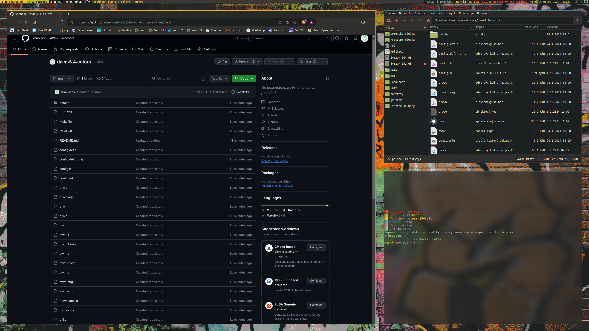

# dwm-6.4-colors
* My personal build of dwm window manager

## Patches
* dwm-actualfullscreen-20211013-cb3f58a.diff
* dwm-adjacenttag-skipvacant-6.2.diff
* dwm-alpha-fixborders-6.2.diff
* dwm-alwayscenter-20200625-f04cac6.diff
* dwm-cfacts-vanitygaps-6.4_combo.diff
* dwm-cyclelayouts-20180524-6.2.diff
* dwm-exitmenu-6.3.diff
* dwm-hide_vacant_tags-6.3.diff
* dwm-movestack-20211115-a786211.diff
* dwm-rainbowtags-6.2.diff
* dwm-restartsig-20180523-6.2.diff
* dwm-rotatetags-20210723-cb3f58a.diff
* dwm-status2d-systray-6.4.diff
* dwm-switchtotag-6.2.diff

** Screenshots

